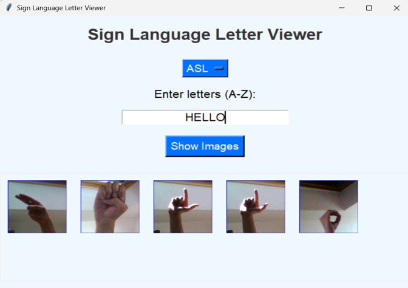
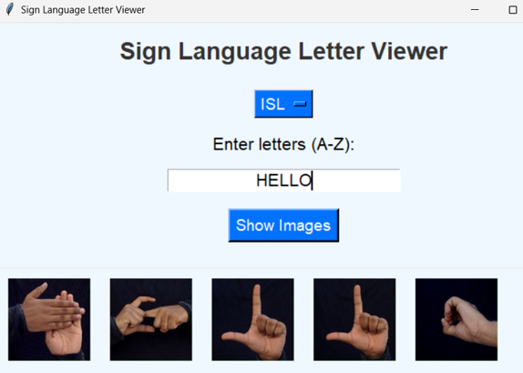
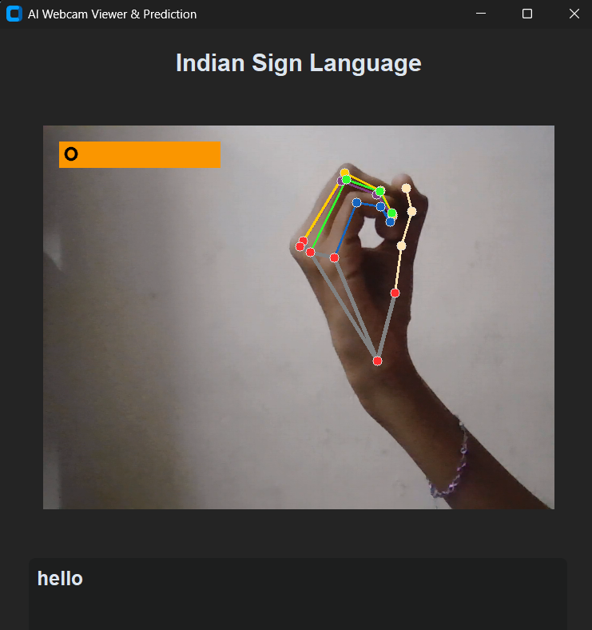
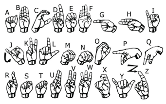
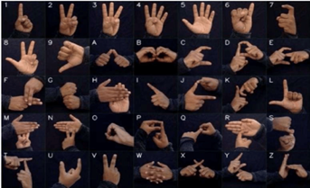

<h1 align="center">🤟 SignEase - ISL & ASL Gesture Recognition</h1>

  

---
# 📊 Project Visualizations  

This section presents the dataset samples, confusion matrices, and performance metrics for both American Sign Language (ASL) and Indian Sign Language (ISL). These visuals highlight the model’s classification accuracy, dataset diversity, and precision scores.

---

## 🖐️ American Sign Language (ASL)

### 🔹 Text to Gesture Image  
  

### 🔹 Confusion Matrix  
  

### 🔹 Precision Score  
  

---

## 🖐️ Indian Sign Language (ISL)
### 🔹 **Text to Gesture**  
  

### 🔹 Sample Image  
  

### 🔹 Confusion Matrix  
  

### 🔹 Precision Score  
  

---

## 📷 Dataset Samples  

The following images represent raw dataset inputs used for training and evaluation. These samples showcase the diversity of gestures captured across different conditions.  

- **Sample 1**  
  

- **Sample 2**  
  

## 📌 Overview  

Communication is one of the most fundamental human needs. For the **hearing- and speech-impaired community**, sign language is the primary medium of interaction.  

👉 **Problem:** Many people do not understand sign language, making communication difficult.  
👉 **Solution:** SignEase bridges this gap by translating **Indian Sign Language (ISL)** and **American Sign Language (ASL)** into text, and vice versa, using **computer vision & deep learning**.  

✨ Features include:  
- Static gesture recognition (ASL & ISL)  
- Dynamic gesture recognition (motion tracking)  
- Text ↔ Gesture translation  
- Real-time & high-accuracy predictions  

---

## 🚀 Features  

✅ Real-time static gesture recognition for **ASL & ISL**  
✅ Dynamic gesture recognition using **finger tracking & motion detection**  
✅ **Bidirectional translation** (Gestures ↔ Text)  
✅ High accuracy models trained on **large-scale datasets**  
✅ Expandable & language-neutral framework to add more sign languages  

---

## 📊 Project Visuals  

### 🖼️ American Sign Language (ASL) Recognition  

### 🖼️ Indian Sign Language (ISL) Recognition  

## 📊 Datasets & Model  

📌 **Indian Sign Language (ISL)**  
- Samples: **29,373**  
- Training: **23,498 (80%)**  
- Testing: **5,875 (20%)**  

📌 **American Sign Language (ASL)**  
- Samples: **8,451**  
- Training: **6,760 (80%)**  
- Testing: **1,691 (20%)**  

🧠 **Classifier Used:** Random Forest Classifier  

📈 **Performance**  
- ASL Accuracy → **99.53%**  
- ISL Accuracy → **99.97%**  

---

## 🛠️ Tech Stack  

**Programming Language:** Python 🐍  

**Libraries & Frameworks:**  
- OpenCV – Real-time computer vision  
- MediaPipe – Hand tracking & keypoint detection  
- Scikit-learn – Random Forest Classifier  
- NumPy, Pandas – Data preprocessing  
- Matplotlib – Visualization  

---

## 🎯 Future Scope  

🔹 Add **speech synthesis** (gesture → voice)  
🔹 Support **dynamic sign sequences**  
🔹 Deploy as a **mobile & web app**  
🔹 Extend to **more sign languages globally**  

---

  
  
  

